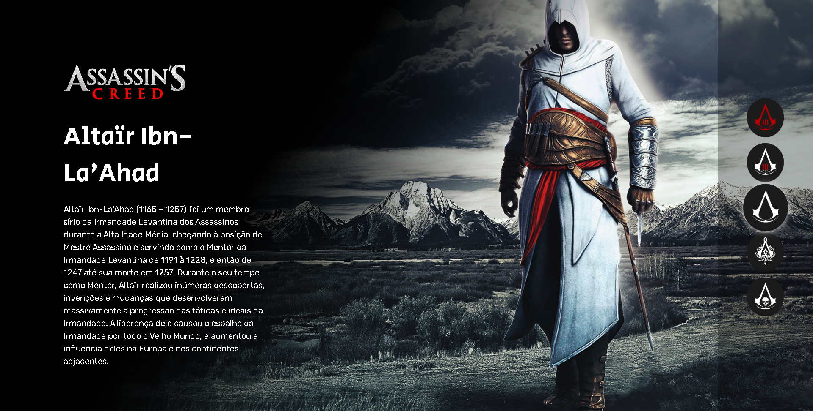
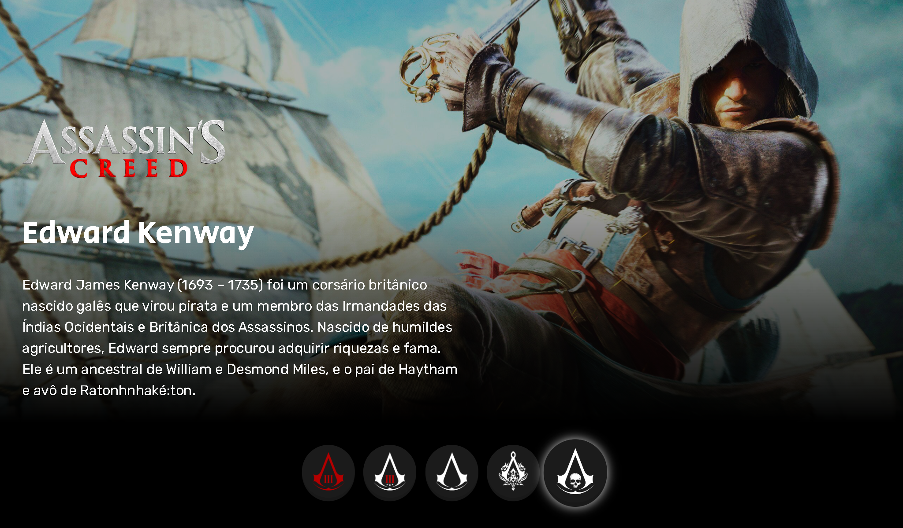

<h1 align="center"> Projeto Assassin's Creed </h1>

  <a href="#-tecnologias">Tecnologias</a>&nbsp;&nbsp;&nbsp;|&nbsp;&nbsp;&nbsp;
  <a href="#-projeto">Projeto</a>&nbsp;&nbsp;&nbsp;|&nbsp;&nbsp;&nbsp;
  <a href="#-funcionalidades">Funcionalidades</a>&nbsp;&nbsp;&nbsp;&nbsp;&nbsp;&nbsp;

 

  

  
  

### 💻 Projeto 
Esse é um projeto Web Responsivo de seleção de personagens que aprendi no evento do Dev em Dobro chamado "Do Zero ao Programador Contratado".

### ⚙ Funcionalidades
- Projeto responsivo
- Interatividade: Ao selecionar seu personagem no menu lateral a imagem de fundo e a descrição do personagem mudará.

### 🚀 Tecnologias
- HTML
- CSS
- JavaScript